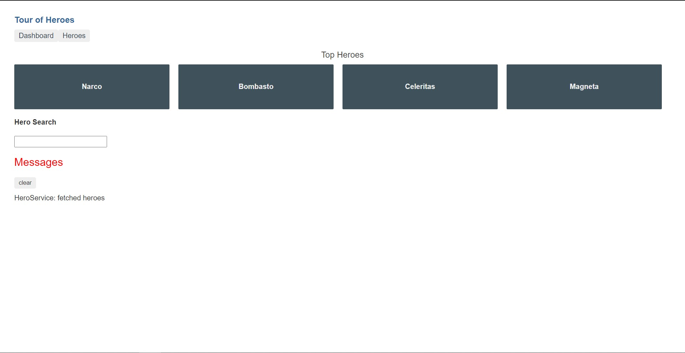
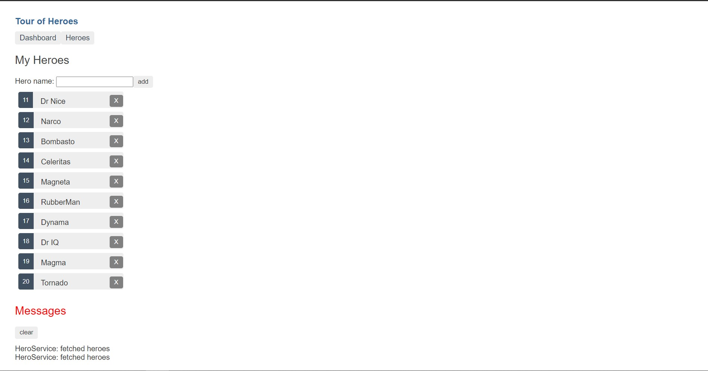
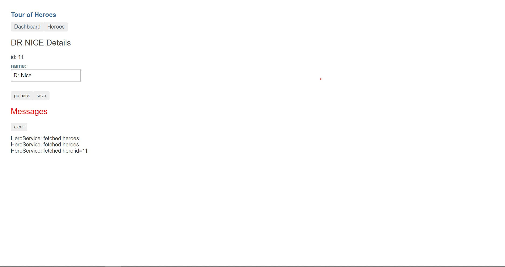

# AngularTourOfHeroes

This project was generated with [Angular CLI](https://github.com/angular/angular-cli) version 11.0.5.

## About Project

This is a Tutorial Project present in Angular Documentation. I developed this project by learning the basic Angular Concepts. The documentation provided by the Angular is super good and it is easy to understand the Development of Angular Project.

## Topics Covered

- Introduction
- Create a Project
- The Hero Editor
  - Creating a HeroComponent, showing the HeroComponent View, Creating a model/inerface, two-way binding.
- Display a List
  - creating mock heroes, displaying them.
- Create a Feature Component
  - Make a HeroDetailComponent, showing HeroDetailComponent.
- Add Services
  - why services, creating services, updating HeroesComponent, Observables.
- Add In-App Navigation
  - Adding routing the app.
- Get Data from a Server
  - Adding Http Module.

## Images

- Dashboard
  

- Heroes View
  

- Heroes Details
  

## Development server

Run `ng serve` for a dev server. Navigate to `http://localhost:4200/`. The app will automatically reload if you change any of the source files.
